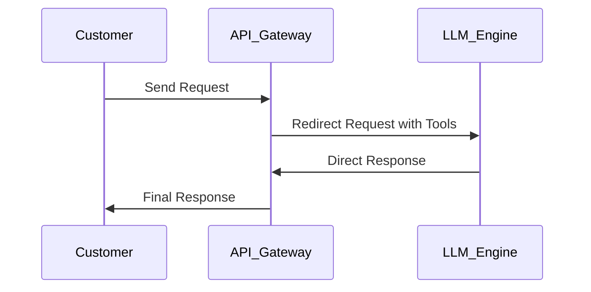
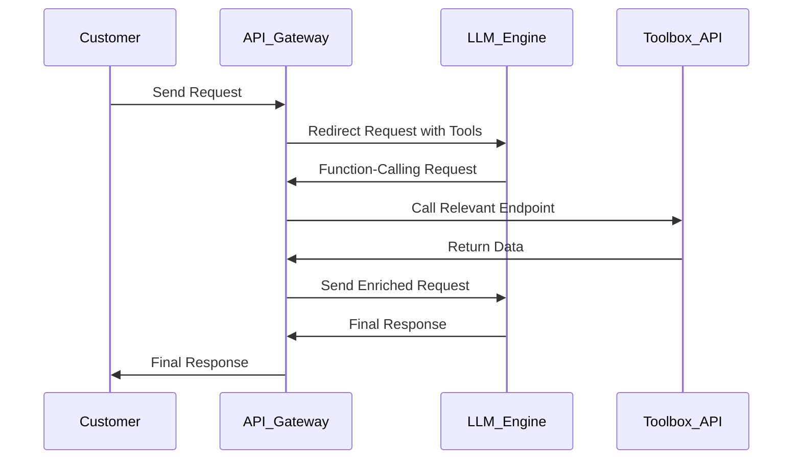

# Bitnet AI Assistant Labs

Bitnet AI Assistant is a LLM-based Agent that acts like a personal Financial Assistant for customers.

This assistant contains of 2 backend services:

- Toolbox API, responsible for serving:
  - Queries related to specific customer's data (balances, transactions and so on...)
  - Queries related to data regarding Bitnet as a whole platform (available assets, fees and so on...)
- API Gateway
  - Acts as an entry point for frontend apps (web and mobile) to send requests and get responses
  - Communicates as a bridge between LLM and Toolbox API

### Gateway

Customer sends a text request to gateway service, and the service responds with a corresponding response based on the input.

The Gateway Service is a simple API for processing customer queries. It accepts a text request from the user and returns a relevant fake response.

### Endpoints

#### `POST /gateway`

Processes customer queries.

#### Request

**Headers**:

- `Content-Type: application/json`

**Body**:

```json
{
  "requestText": "Your query text here"
}
```

#### via curl:

```bash
curl -X POST http://localhost:8081/gateway \
  -H "Content-Type: application/json" \
  -d '{"requestText": "what is my balance of BTC?"}'

```

#### response:

```json
{
  "responseText": "Your balance of BTC is 0.5 BTC."
}
```

## Toolbox

There are several tools (functions/API-endpoints) available in a Bitnet Assistant's Toolbox. These tools are available via REST API exposed by toolbox service:

### Endpoints

| Endpoint           | Method | Query Parameters                         | Description                               |
| ------------------ | ------ | ---------------------------------------- | ----------------------------------------- |
| `/balances`        | GET    | `userId` (required)                      | Retrieves balances for a user.            |
| `/transactions`    | GET    | `userId` (required)                      | Retrieves transaction history for a user. |
| `/exchange-fees`   | GET    | `symbol` (required)                      | Retrieves exchange fees for a symbol.     |
| `/exchange-pairs`  | GET    | None                                     | Retrieves available exchange pairs.       |
| `/exchange-rates`  | GET    | `symbol` (required)                      | Retrieves exchange rates for a symbol.    |
| `/withdrawal-fees` | GET    | `asset` (required), `network` (optional) | Retrieves withdrawal fees for an asset.   |

## Request-Response Cycle

From customer's request to response to them assistant goes through these steps:

- API Gateway redirects customer's request to (alongside the signatures of available functions/tools)
- LLM decides to either directly address to customer's request or request some function calls from API Gateway to gather more information.
- If LLM responds with function-calling request, API Gateway calls appropriate endpoints of Toolbax API and re-sends customer's (enriched with data) request to LLM
- LLM responds with final answer that will be redirected to customer by API Gateway

Let's take a look at each case:

### Case 1: Direct Response by LLM



### Case 2: Function Call to Toolbox API



## Resources

- [openai guides - Function calling](https://platform.openai.com/docs/guides/function-calling)
- [openai guides - Structured Outputs](https://platform.openai.com/docs/guides/structured-outputs)
- [openai guides - Fine-tuning](https://platform.openai.com/docs/guides/fine-tuning)
- [openai cookbook - Fine tuning for function calling](https://cookbook.openai.com/examples/fine_tuning_for_function_calling)
- [openai cookbook - Structured Outputs for Multi-Agent Systems](https://cookbook.openai.com/examples/structured_outputs_multi_agent)
